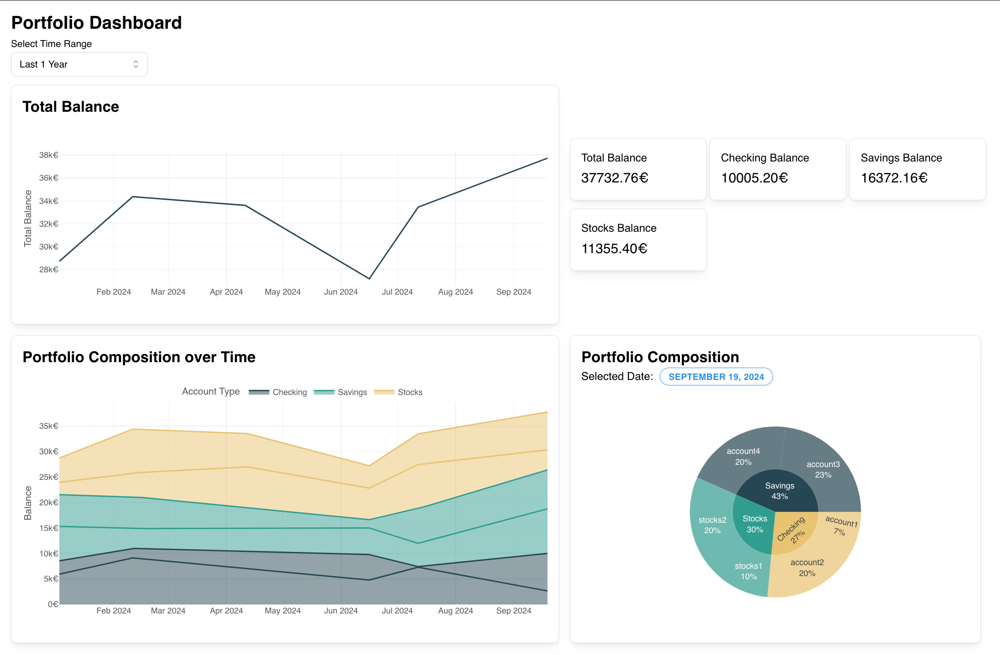

# Portfolio Analysis

This project provides a visual tool to analyze balances of multiple accounts, including bank accounts, investment accounts, and cryptocurrency wallets. The tool offers a dashboard for visualizing account balances over time and generating insights into financial data.



## Installation

### Setting Up the Environment

To set up a virtual environment using `pyenv` and `virtualenv`, run the following command:

```bash
make create_virtualenv
```

### Verifying the Environment

To verify that the environment has been set up correctly, run:

```bash
make test_environment
```

### Installing Dependencies

To install the necessary dependencies, run:

```bash
make requirements
```

## Usage

To start the application, run the following command:

```bash
python dashboard/dashboard.py
```

Then open your browser and navigate to [http://localhost:8050/](http://localhost:8050/).

## Data Structure

The data for this project is organized into the following main components:

- **Accounts**: Each account has a unique identifier, a type (e.g., bank, investment, cryptocurrency), and a balance.
- **Balances**: Historical balance data for each account, recorded over time to track changes and trends.

The data is stored in CSV format (see `data/raw/accounts_sample.csv` and `data/raw/balance_sample.csv` for examples) and is loaded into the application for analysis and visualization.

## Room for Improvement

- **Support Multiple Currencies**: Add functionality to handle and convert multiple currencies.
- **Additional Charts**: Include more types of charts for better data visualization.

## License

This project is licensed under the MIT License. See the [LICENSE](LICENSE) file for details.

---

*Project based on the [cookiecutter data science project template](https://drivendata.github.io/cookiecutter-data-science/). #cookiecutterdatascience*
